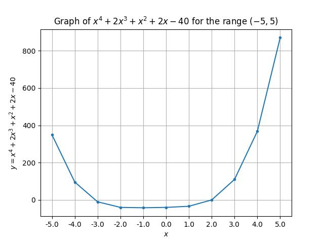

# Numerical Analysis Assignment

## Newton-Raphson method vs Bisection method

The equation used for in both of the methods is:

${f(x) = x^4+ 2x^3 + x^2 + 2x - 40}$

Its derivative is:

${df/dx = 3x^3 + 6x^2 + 2x + 2}$

The graph of the equation is as shown

